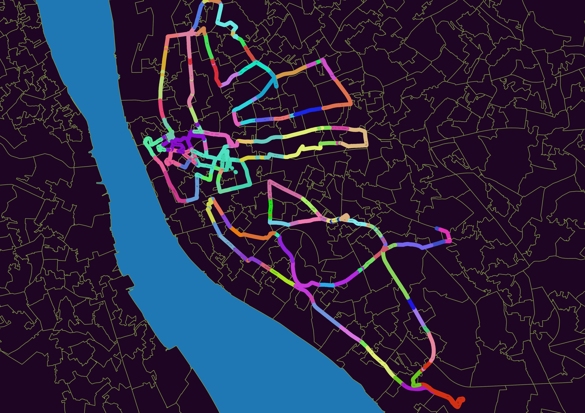
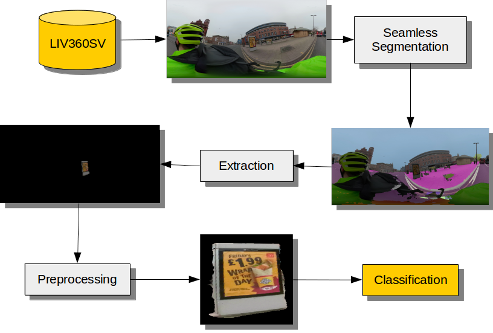

# LIV360SV 

We present a workflow for extracting and classifying advertisements located within street level images. We use a seamless scene segmentation network to identify regions within street-level images where advertisements are located. To subsequently classify the extracted advertisements we train a MobileNet-V2 to differentiate advertisement types using data scraped from Google Images. We introduce the Liverpool 360 Street View (LIV360SV) dataset for evaluating our workflow. The dataset contains 26,645, 360 degree, street-level images collected via cycling with a GoPro Fusion 360 camera.

## Data

### The Liverpool 360 Street View Dataset

While there exists an abundance of street-level imagery on platforms such as Google Street View, the recently imposed costs for using Google's API, as well as cases of Google updating terms and conditions to hinder researchers, highlights the need for alternative open sourced solutions. 
Existing open and crowd sourced street-level images predominately lack the quality of the interactive panoramas found on services such as Google Street View. Images are frequently recorded using dashboard cameras, and as a result have a restricted field of vision. Motivated by these factors we record an open street-level dataset for Liverpool, using a GoPro Fusion 360 camera attached to a member of the team ([Mark Green](https://scholar.google.com/citations?user=_9XrEoIAAAAJ&hl=en&oi=ao)) who cycled along major roads. We follow Mapillary's [recommendations](https://help.mapillary.com/hc/en-us/articles/360026122412-GoPro-Fusion-360) for recording street-level images. The camera records front and back images at 0.5 second interval, which we later stitch together using GoPro Fusion Studio. To date our dataset consists of 26,645 street-level images each with GPS location recorded. We illustrate the current coverage of the LIV360SV dataset in below. 

We focused on sampling three areas of Liverpool with varying contexts over three different days: (1) City Centre (Jan 14th 2020) - areas characterised by shops and services; (2) North Liverpool (Jan 15th 2020) - areas contain high levels of deprivation; (3) South Liverpool (Jan 18th 2020) - areas include a mixture of affluent populations and diverse ethnic groups. We have uploaded our street level images to Mapillary, which can be viewed [here](https://www.mapillary.com/app/org/gdsl_uol?lat=53.39&lng=-2.9&z=11.72&tab=uploads). The images can be downloaded with [Mapillary Tools](https://github.com/mapillary/mapillary_tools) using the following command: 

```
mapillary_tools download --advanced --by_property key \
--import_path dev/null \
--output_folder '.' \
--organization_keys 'I8xRsrajuHHQRf6cdDgDi5' \
--user_name '<Insert Mapillary Username>'
```

To date we have identified 10,106 advertisements within these data, manually classified as food (1335), alcohol (217), gambling (149) and other (8405). Download the dataset as a .zip archive from:
[LIV360SV_Labelled_Ads.zip](https://drive.google.com/open?id=1oVKQyhaK1iDkHZJSYR6d6_-T_39E-Ubw)
Filesize: 1.1 GB
md5sum: 5dd96f9ee9d3f474bd949ee901c6a147  



### Advertisement Data

While the Mapillary Vistas includes a billboards category, the dataset does not distinguish different types of advertisements. Further annotations would therefore be necessary to train panoptic scene segmentation networks to differentiate between advertisement types. However, manually annotating segmentation masks is a time consuming task. Instead, we propose to classify advertisements extracted from street level images using a model trained to classify advertisement images. Google Images is a useful resource for obtaining data for training and evaluating deep learning architectures. We use this resource to build an advertisement dataset. First we compile a list of relevant keywords describing brands, business names and key terms. The keywords are subsequently used to scrape images using Python's [Google Image Download package](https://pypi.org/project/google_images_download/):

```
pip install google_images_download 
```

Duplicate images are removed using [FDUPES](https://github.com/adrianlopezroche/fdupes). 

## Workflow Components



### Seamless Scene Segmentation

For extracting advertisements from street level images we use the seamless scene segmentation network introduced by [Porzi et al. (2019)](https://arxiv.org/pdf/1905.01220.pdf). The network offers advantages of both semantic segmentation -- determining the semantic category that a pixel belongs to -- and instance-specific semantic segmentation -- the individual object that a pixel belongs to, enabling differentiation between neighbouring entities of the same type. The authors achieve state-of-the-art results on three street-view datasets, including [Cityscapes](https://arxiv.org/pdf/1604.01685.pdf), the [Indian Driving Dataset](https://arxiv.org/pdf/1811.10200.pdf) and [Mapillary Vistas](https://research.mapillary.com/img/publications/ICCV17a.pdf). To install the seamless scene segmentation implementation visit:

https://github.com/mapillary/seamseg

### Extraction

Upon identifying the location of an advertisement, we obtain a one hot mask with a filled convex hull using [OpenCV's](https://opencv.org/) find and draw contours functionalities. The masks allow us to extract individual advertisements from the original input images. 

### Preprocessing

With the remaining content having been masked out during the extraction step we subsequently crop the images. However, given that the final step of our workflow is to pass the extracted items to a classifier trained on advertisement images with a frontal view, we use a [Spatial Transformation Network (STN)](https://arxiv.org/pdf/1506.02025.pdf) to transform the extracted items, the majority of which were recorded from a non-frontal view.  

### Classification

We classify extracted advertisements using Keras' [MobileNet-V2](https://keras.io/applications/#mobilenetv2) implementation. The network is trained using manually labelled extracted samples augmented with the scraped images dataset. 


 
